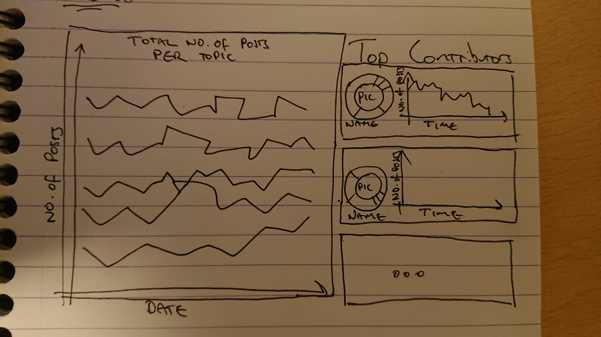

# Trends

This project was bootstrapped with [Create React App](https://github.com/facebook/create-react-app).

# Running the project

To run the project, set the `endpoint` in both the `sync` and `start` commands so that it points to the desired graphql server then run `yarn start`

In order to sync the types with the apollo server, the steps from [this blog post](https://www.apollographql.com/blog/tooling/apollo-codegen/typescript-graphql-code-generator-generate-graphql-types/) were followed. This will happen automatically on start.

# Attributions

There is a problem with the faker avatars at the moment. I've had to use a [fallback image](https://commons.wikimedia.org/wiki/File:Portrait_Placeholder.png) provided by wikipedia creative commons.  This should be attributed.

# Testing

Tests can be run with `yarn test`

# Design

The initial design was sketched on a notepad. Key features of the design are:
 - Combined topic trends for all users by month
 - User specific cards
 - The ability to filter the user posts by a topic of interest
 - A donut chart which encloses the user avatar to highlight their favorite topics (partially implemented)

# Challenges

Coordinating the figure colors is not straightforwards with visx, this made the donut chart less valuable than hoped. In order to keep the insights as clear as possible, it has been removed for now

# Next steps
The post aggregations and groupings should be revisited in order to make them as performant as possible.

Co-ordinate color in the donut chart and add it to the avatar border as per the design.

Add a user detail view which renders their posts for further analysis.

# API improvements
The graphql api could be tightened up in order to reduce uncertainty on the FE around requests / responses.
 - Count is not specified as required but an error is thrown if the arg is omitted
 - Posts are typed as possibly null, but the api might filter out null values before returning them
 - More query parameters could be added in order to filter the posts by user id or date or topics etc
 - Selecting the most likely topic could take place on the server side, which would improve the client side experience
